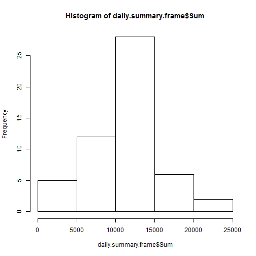
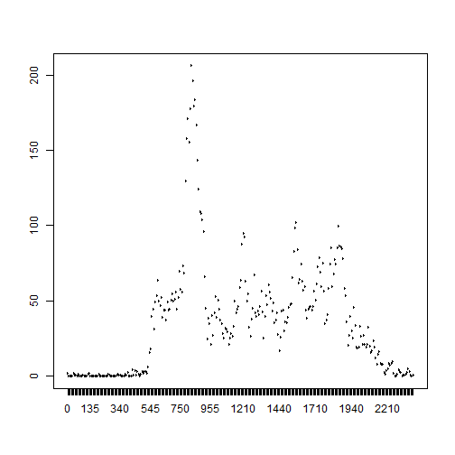
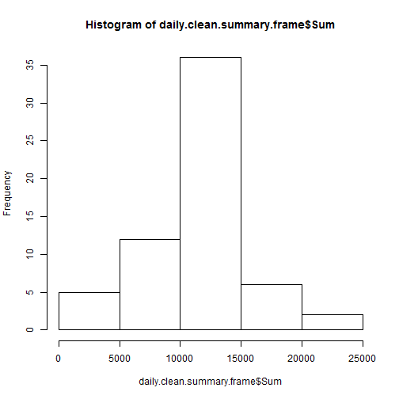
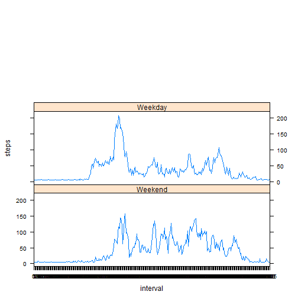

** NOTE: I will commit analytics.R in same time. This R file could be debug and processed in a single R process. **


## Loading and preprocessing the data

To load the data, the zip file would be unziped and read the total data into a data frame.


```r
unzip("activity.zip")
data.total <- read.csv2("activity.csv", sep=",")
```

In major scenario, the na data would be removed. And the data with scener data is stored into data.exist frame.


```r
# Remove unexisting data
data.exist <- data.total[!is.na(data.total$steps),]
```


## What is mean total number of steps taken per day?

Daily summary frame would including mean and sum steps, grouped by date. And releated analytics is based on this analytics.


```r
library(dplyr)
```

```
## 
## Attaching package: 'dplyr'
## 
## The following object is masked from 'package:stats':
## 
##     filter
## 
## The following objects are masked from 'package:base':
## 
##     intersect, setdiff, setequal, union
```

```r
daily.summary.frame <- data.exist%>%
  group_by(date)%>% 
  summarise(Mean=mean(steps), Median=as.numeric(median(steps)), Max=max(steps), Min = min(steps), Sum=sum(steps))


# Total number of steps taken per day
hist(x=daily.summary.frame$Sum)
```

 

```r
# Mean and Median
daily.summary <- summary(daily.summary.frame$Sum)
```

Based on daily.summary, we can understand:

* Mean is 1.077 &times; 10<sup>4</sup>

* Median is 1.076 &times; 10<sup>4</sup>


## What is the average daily activity pattern?

Make a time series plot (i.e. type = "l") of the 5-minute interval (x-axis) and the average number of steps taken, averaged across all days (y-axis)


```r
# Median and Mean Data of total daily steps
daily.interval.mean <- aggregate(data.exist$steps, list(as.factor(data.exist$interval)), mean)

# Max Steps
daily.interval.max.fram <- daily.interval.mean[order(-daily.interval.mean$x), ]
daily.interval.max <- daily.interval.max.fram[1, 1:2]
daily.interval.max.step <- daily.interval.max[2]
daily.interval.max.inter <- daily.interval.max[1]

plot(x=daily.interval.mean$Group.1, y=daily.interval.mean$x, type="l")
```

 

The max interval is 835 and the max step is 206.1698113

## Imputing missing values


```r
data.total.na.sum <- sum(is.na(data.total$steps))
```

Calculate and report the total number of missing values in the dataset, it is 2304.


In this case the NA would be filled by mean steps.


```r
daily.step.mean <- mean(daily.interval.mean$x)
data.total.clean <- data.total
data.total.clean$steps[is.na(data.total.clean$steps)]<-daily.step.mean

daily.clean.summary.frame <- data.total.clean%>%
  group_by(date)%>% 
  summarise(Mean=mean(steps), Median=as.numeric(median(steps)), Max=max(steps), Min = min(steps), Sum=sum(steps))

# Total number of steps taken per day
hist(x=daily.clean.summary.frame$Sum)
```

 

```r
# Mean and Median
daily.clean.summary <- summary(daily.clean.summary.frame$Sum)
```

Based on daily.clean.summary, we can understand:

* Mean is 1.077 &times; 10<sup>4</sup>

* Median is 1.077 &times; 10<sup>4</sup>

Because the NA is filled by mean data, thus, the mean is same while the median is adjusted.


## Are there differences in activity patterns between weekdays and weekends?

Create a new factor variable in the dataset with two levels – “weekday” and “weekend” indicating whether a given date is a weekday or weekend day.


```r
weekday.frame <- data.frame(Weekday=weekdays(as.Date(data.total$date)))
weekday.weekend <- as.factor(ifelse((weekday.frame$Weekday %in% c("Saturday","Sunday")), "Weekend", "Weekday"))
data.total.clean <- cbind(data.total.clean, Day = weekday.frame)
data.total.clean <- cbind(data.total.clean, Weekend = weekday.weekend)

data.total.clean.weekday <- data.total.clean[which(data.total.clean$Weekend == "Weekday"),]
daily.interval.clean.weekday <- aggregate(data.total.clean.weekday$steps, list(as.factor(data.total.clean.weekday$interval)), mean)
daily.interval.clean.weekday <- cbind(daily.interval.clean.weekday, Weekend = "Weekday")

data.total.clean.weekend <- data.total.clean[which(data.total.clean$Weekend != "Weekday"),]
daily.interval.clean.weekend <- aggregate(data.total.clean.weekend$steps, list(as.factor(data.total.clean.weekend$interval)), mean)
daily.interval.clean.weekend <- cbind(daily.interval.clean.weekend, Weekend = "Weekend")

daily.interval.weekend <- rbind(daily.interval.clean.weekend, daily.interval.clean.weekday)
names(daily.interval.weekend) <- c("interval", "steps", "Weekend")
```

Make a panel plot containing a time series plot (i.e. type = "l") of the 5-minute interval (x-axis) and the average number of steps taken, averaged across all weekday days or weekend days (y-axis). 


```r
library(lattice)
xyplot(steps ~ interval | Weekend, data=daily.interval.weekend, type="l", layout=(c(1,3)))
```

 

